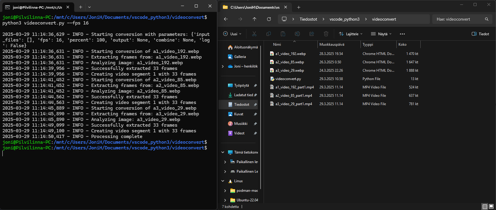
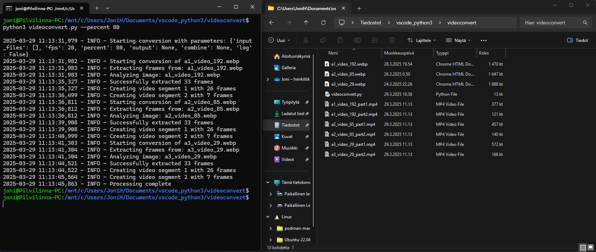
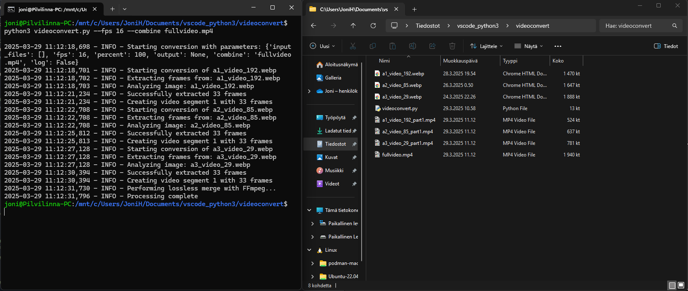

# Webp to mp4 video converter
Didin't find any good webp to mp4 offline converter so i made simple one with Python3. Tested with WSL ubuntu 22.04.5LTS and Windows 11.
# Requirement:
Any OS that supports python3
* Python3
  + Python3 Pillow
  + Python3 Moviepy
  + Python3 Argparse
  + Python3 Glob2
* FFMPEG

# Install for Ubuntu bash
`sudo apt-get update`\
`sudo apt-get install python3`\
`pip3 install moviepy pillow argparse glob2`\
`sudo apt-get install ffmpeg`
# Install for Windows cmd
`winget install python3`\
`pip3 install moviepy pillow argparse glob2`\
`winget install ffmpeg`
# Usage:
Copy videoconvert.py in same folder as webp video files. Test commands (no user inputs default setting is 20framespersecond: \
`videoconvert.py`\
`python3 videoconvert.py` \
# Commandline user inputs
| Argument | Description|
|----------|-------------|
| `--fps 16` | Video frames per second |
| `--percent 80` | Split video into two parts by % |
| `--output .\folder` | Directory for output MP4 files |
| `--combine video.mp4` | Combine multible converted videos to 1 |
| `--reverse` | Reverse the video playback |
| `--loop` | Create seamless loop by appending reversed frame sequence |
| `--log` | Enable logging to webp_converter.log file |

# Examples
### Convert all webp files in same folder
Run test code: `python3 videoconvert.py --fps 16`\
\

### Convert percentage parts of video into 2 videos
Run test code: `python3 videoconvert.py --percent 80`\
\

### Convert videos and combine all to one video
Combined all videos from folder (videos sorted by filename a-z and 1-9), (combining videos may fail if the videos are incompatible with each other, such as having different resolutions)\
Run test code: `python3 videoconvert.py --fps 16 --combine fullvideo.mp4`\
\

### Reversing video frames
This seems to be the best point for reversing videos, since we are just saving and restacking frames in the right order to convert webp to mp4. /
Run test code: `python3 videoconvert.py --reverse`

### Basic looping video
Works with stacking video frames normally forward, then immediately playing the same video video backwards and combining these to 1 video file. So you get a basic seamless back‑and‑forth loop.\
Run test code: `python3 videoconvert.py --loop`\
\
Sample looping video:\
https://github.com/user-attachments/assets/b2931713-c16b-4a06-ad62-e29b3cd72645

### Save local logs in text file with --log (for debugging)
Run test code: `python3 videoconvert.py --log --fps 16 --combine fullvideo.mp4`\
\

